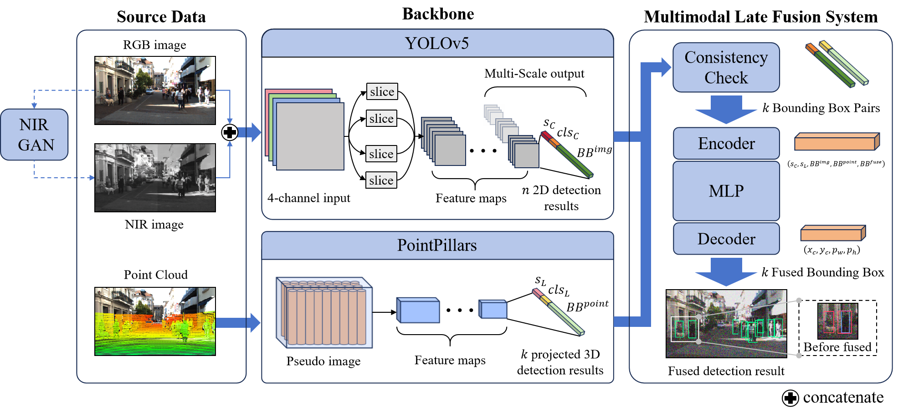

# RMF-ED: Real-Time Multimodal Fusion for Enhanced TargetDetection in Low-Light Environments

This is the code files of paper *RMF-ED: Real-Time Multimodal Fusion for Enhanced Target
Detection in Low-Light Environments.*

## Brief introduction


In this study, we introduce RMF-ED (Real-Time Multimodal Late Fusion for Enhanced Detection), a multi-modality fusion framework designed to overcome the limitations of low-light target detection. By leveraging the complementary capabilities of near-infrared (NIR) cameras and LiDAR sensors, RMF-ED enhances detection performance.

An NIR-GAN model was developed to address the lack of annotated NIR datasets, integrating Structural Similarity Index (SSIM) loss and L1 loss functions. This approach enables the generation of high-quality NIR images from RGB datasets, bridging a critical gap in training data.

<center>Results of integrating SSIM & L1 loss</center>


<center>The best propotion of SSIM.</center>

Furthermore, our multimodal late fusion algorithm integrates RGB images, NIR images, and LiDAR point clouds, ensuring consistency and accuracy in proposal fusion. Experimental results on the KITTI dataset demonstrate that RMLF-ED achieves performance comparable to or exceeding state-of-the-art fusion algorithms, with a computational time of only 21ms.


<center>Results of our methods on KITTI dataset</center>

## File Structure

The file structure is as follows:

- **devkit_object**
KITTI Official vision benchmark suit for testing
- **experiment**
Code for testing and results
- **ICCV_MAET**
Implementation of *Multitask AET with Orthogonal Tangent Regularity for Dark Object Detection*(<https://github.com/cuiziteng/ICCV_MAET>) which generates dark images from normal RGB ones
- **ImageSets**
Official KITTI files for datasets splitting
- **KITTI_image_modify**
To modify images from KITTI datasets. Including
 1. Splitting an image in half
 1. Transform RGB images to dark images
 1. Transform RGB images to NIR images
- **kitti-object-eval-python-master**
Fast kitti object detection eval in python, see <https://github.com/traveller59/kitti-object-eval-python>
- **PointPillars**
An implementation of PointPillars, see <https://github.com/zhulf0804/PointPillars>
- **pytorch-CycleGAN-and-pix2pix**
An implementation of cycleGAN in Pytorch, see <https://github.com/junyanz/pytorch-CycleGAN-and-pix2pix>
- **MLP_train.py**
Code for taining fusion model
- **MLP_utils.py**
Utils for training
- **Dataloader.py**
Load KITTI data
- **BBP_0.7_GT_0.5.pth**
Checkpint of fusion model

## Required Data
You need to download KITTI dataset including *velodyne_reduced*, *calib*, *image_2* and *label_2*

## Training
You can train RMF by the following code
`python MLP_train.py --kitti_path path_of_kitti --save_path path_to_save_ckp --epoch trainning_epoch`
To modify the IoU threshold of Bounding Box Pair and ground truth alignment, you can change the parameter below in file *MLP_utils.py*
```
THRESHOLD_BBP = 0.7
THRESHOLD_GT = 0.5
```

## Generating Results
You can generate detection results by
`python MLP_test.py --kittii_path path_of_kitti --ckp_path path_of_MLP_ckp --val_path path_of_val_txt -- result_path path_to_save_results --yolo_path path_of_yolo_ckp`
<!-- ## Future Works - Data Collection in Real Environments
Quadrotor UAV platform for data collection. Equipped with:
- Monocular camera
- LiDAR
- T-Motor F90
- Jetson Xavier NX
- Q380机架


*Elastic-Tracker flexible tracking framework* integrated for stable tracking and SLAM tasks


RGB and NIR image data collected in low-illumination environment

 -->